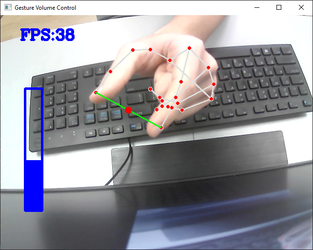

# Gesture_Volume_Control_Python

This is a programm made in python that allows you to controll the sound of your pc using your fingers. The HandTrackingModule is responsible for tracking your hand in the main programm(GestureVolumeControl) and it uses the "mediapipe", "cv2", "math", "time" libraries.

